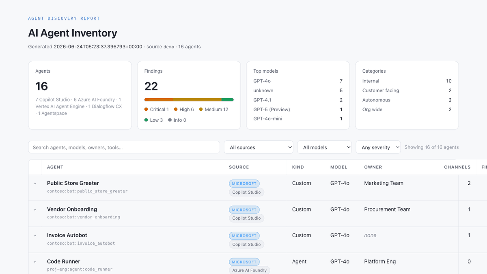
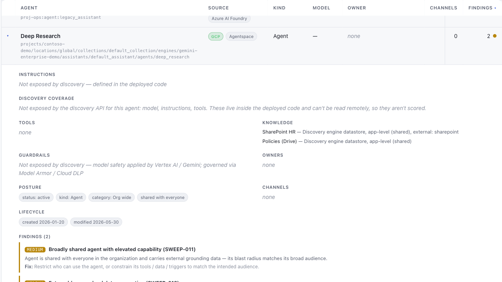

<!-- Badge: update kjack3434/AgentCensus if the repo slug changes. -->
[](https://github.com/kjack3434/AgentCensus/actions/workflows/ci.yml)
[](LICENSE)
[](https://www.python.org/downloads/)

# AgentCensus

**A simple, ad-hoc view of your AI agent estate — run it when you need it.**

AgentCensus pulls your agents from across **Microsoft Copilot Studio**, **Azure AI Foundry**, and **Google
Cloud** (Vertex AI Agent Engine, Agentspace / Gemini Enterprise, Dialogflow CX) and combines the scattered
details — models, tools, knowledge sources, owners, channels, posture, and governance flags — into one
self-contained HTML report, so you can review the whole estate at a glance instead of clicking through
portals. It also surfaces a few governance risks (public/unauthenticated bots, autonomous actions without
approval, ungoverned models, broad exposure, external/cross-cloud data connections). The result is one file
you can open, share, or attach to a ticket — no database, no server, nothing to set up but Python.

> **Early & evolving.** This is a lightweight, ad-hoc snapshot — not a full governance platform. Microsoft is
> fully supported; **Google Cloud is an initial release** (see [Google Cloud](#google-cloud-initial-release))
> with broader coverage and deeper checks to follow.

> **Read-only & private.** AgentCensus only *reads* discovery metadata — it never creates, modifies, or deletes
> anything in your tenant or project. It sends **no telemetry**; it talks only to Microsoft's and Google
> Cloud's own APIs.

## Contents

- [Quick start](#quick-start-no-account-needed)
- [Sample report](#sample-report)
- [What it finds](#what-it-finds)
- [Discover your live agents](#discover-your-live-agents)
- [Google Cloud (initial release)](#google-cloud-initial-release)
- [Sources](#sources)
- [Command reference](#command-reference)
- [Output](#output)
- [Findings](#findings)
- [Use it in CI](#use-it-in-ci)
- [Troubleshooting](#troubleshooting)
- [Security](#security) · [Contributing](#contributing) · [License](#license)

## Quick start (no account needed)

**New to tools like this?** You need three free tools first — install whichever you don't already have
(one-time):

| Tool | What it's for | Install |
|---|---|---|
| **Git** | downloads the code | [git-scm.com/downloads](https://git-scm.com/downloads) |
| **Python 3.12+** | runs AgentCensus | [python.org/downloads](https://www.python.org/downloads/) |
| **uv** | installs dependencies & runs it in one step | [astral.sh/uv](https://docs.astral.sh/uv/getting-started/installation/) |

Then open a terminal (Terminal on macOS, PowerShell on Windows) and copy-paste these three steps:

```bash
# 1 — download the code
git clone https://github.com/kjack3434/AgentCensus.git
cd AgentCensus

# 2 — install dependencies
uv sync

# 3 — open a sample report (synthetic data — no Azure account, no sign-in)
uv run agentcensus sweep --demo --open
```

Step 3 opens an interactive HTML report built from a **synthetic sample estate** (~16 fictional agents across
Microsoft and Google Cloud). If that worked, you're ready to point it at your real tenant — see
[Discover your live agents](#discover-your-live-agents) (Microsoft) or
[Google Cloud](#google-cloud-initial-release).

<details>
<summary>Prefer plain <code>pip</code> instead of uv?</summary>

```bash
python -m venv .venv && source .venv/bin/activate   # Windows: .venv\Scripts\activate
pip install -e .
agentcensus sweep --demo --open
```
</details>

> The examples below use `uv run agentcensus …` (works from the cloned folder after `uv sync`). If you used the
> `pip` route above with the venv activated, drop the `uv run` prefix and just type `agentcensus …`.

## Sample report

This is the `--demo` report (synthetic data). A ready-to-open copy is committed at
[`examples/sample-report.html`](examples/sample-report.html) — download it and open in any browser.



Each agent expands to its full configuration and findings, each with a one-line remediation:



## What it finds

Each agent is normalized to a flat record: name, source, kind, model (+ tier), instructions, tools, knowledge
sources, guardrails, owners, channels, status, lifecycle dates, and posture flags (autonomous,
shared-with-everyone, no-auth-required, multi-tenant). On top of that, governance rules flag risk — see
[Findings](#findings).

---

## Discover your live agents

One `sweep` covers your **whole estate**. `--source all` (the default) discovers Microsoft **Copilot Studio**
+ **Azure AI Foundry** *and* **Google Cloud**; `--auth` chooses *how* you sign in and is applied to each cloud
with its own mechanism. Sign into the clouds you use — any cloud you're **not** signed into is skipped with a
warning, and the run prints an `Auth —` line showing what it used. Everything is **read-only**. Run the
commands below from the `AgentCensus` folder you cloned in [Quick start](#quick-start-no-account-needed).

### The fastest run — reuse your CLI sign-ins (`--auth cli`, the default)

```bash
az login                 # Microsoft: Copilot Studio + Foundry
gcloud auth login        # Google Cloud (skip if you don't use GCP)

uv run agentcensus sweep --project YOUR_GCP_PROJECT --open
```

`--auth cli` borrows your existing `az` / `gcloud` sessions — no app registration, no key. `--project` tells
GCP what to scan (it has no org-wide enumeration); **omit it if you're not scanning GCP**.

**Only one cloud?** Narrow `--source` so the others aren't attempted:

```bash
uv run agentcensus sweep --source copilot-studio,foundry --open            # Microsoft only
uv run agentcensus sweep --source gcp --project YOUR_GCP_PROJECT --open     # Google Cloud only
```

> Missing a cloud CLI? Install the [Azure CLI](https://learn.microsoft.com/cli/azure/install-azure-cli)
> (`az login --tenant <id>` targets a specific tenant) and/or the
> [gcloud CLI](https://cloud.google.com/sdk/docs/install). If Copilot Studio specifically errors under `cli`
> (some tenants restrict which apps may call **Dataverse**, the store behind Copilot Studio), use
> `--auth device` for it — the failing connector is skipped with a warning and everything else still completes.

### Auth strategies

`--auth` is a **strategy** applied per provider — one flag, both clouds:

| `--auth` | Microsoft (Copilot Studio + Foundry) | Google Cloud | Best for |
|---|---|---|---|
| **`cli`** (default) | reuse `az login` | reuse `gcloud auth login` | quick interactive / personal runs |
| **`app`** | Entra app + client secret | service-account key (`--gcp-key-file`) | CI / automation / unattended |
| **`device`** | Entra device-code sign-in | *(Microsoft only)* | repeatable interactive, no app/CLI |
| **`adc`** | *(Google only)* | Application Default Credentials | GCP local dev / workload identity |

`cli` needs only the CLI sign-in. The Microsoft `device` / `app` strategies need a one-time **app
registration** (below); the Google `app` / `adc` strategies need the optional **`[gcp]` extra** — see
[Google Cloud](#google-cloud-initial-release). Whichever you pick, the identity also needs **read** access to
the agents — Microsoft roles in [What the identity needs to read](#what-the-identity-needs-to-read), GCP roles
in the Google Cloud section.

### Microsoft app registration — for `--auth device` / `app`

`--auth cli` needs none of this. The `device` and `app` strategies need a one-time Entra app registration.

**`--auth device`** — repeatable interactive sign-in that acts as you:

```bash
uv run agentcensus sweep --auth device --client-id <app-client-id> \
  --source copilot-studio,foundry --open
# you'll be prompted to open https://microsoft.com/devicelogin and enter a code
```

One-time app registration (public client):

1. **Entra admin center** (Microsoft's identity portal, formerly Azure AD) **→ App registrations → New
   registration.** Name it (e.g. `agentcensus`). Register.
2. **Authentication → Advanced settings → Allow public client flows → Yes.** (Enables device code; no
   redirect URI needed.)
3. **API permissions → Add a permission → Delegated:**

   | API | Delegated permission | For |
   |---|---|---|
   | Dynamics CRM | `user_impersonation` | Copilot Studio (Dataverse) |
   | Azure Service Management | `user_impersonation` | Foundry (control plane) |
   | *(Azure AI data plane `https://ai.azure.com`)* | consented at first run | Foundry (agents) |

4. Copy the **Application (client) ID** → pass as `--client-id` (or set `AGENTCENSUS_CLIENT_ID`).

**`--auth app`** — service principal; no interactive sign-in, runs as the app itself (CI / unattended):

```bash
export AGENTCENSUS_CLIENT_SECRET='…'        # keep the secret out of shell history
uv run agentcensus sweep --auth app \
  --tenant <tenant-id> --client-id <app-id> \
  --source copilot-studio,foundry --out report.html
```

One-time setup (service principal):

1. **Certificates & secrets → New client secret** on the app registration. Store the value as
   `AGENTCENSUS_CLIENT_SECRET`.
2. **Copilot Studio (Dataverse S2S):** for each environment,
   **Power Platform admin center → Environment → Settings → Users + permissions → Application users →
   New app user**, add the app, and assign a **read** security role on the bot tables.
3. **Foundry:** assign the service principal Azure RBAC **Reader** on the subscription(s) **and** a read role
   on the Foundry project(s)/account(s).

> To sweep **both clouds** under `--auth app`, combine this Microsoft app with a GCP service-account key
> (`--gcp-key-file`) and drop the `--source` filter — each provider uses its own `app` credential.

### What the identity needs to read

Regardless of auth strategy, the Microsoft account or service principal must be able to *read* the agents
(Google Cloud roles are in the [Google Cloud](#google-cloud-initial-release) section):

| Ecosystem | Read access required |
|---|---|
| **Copilot Studio** (Dataverse) | A Power Platform security role that can **read** the `bot` and `botcomponent` tables in each environment (admins see everything; or use a custom read-only role). |
| **Azure AI Foundry** | Azure RBAC **Reader** on the subscription(s), plus a read role on the Foundry project/account (e.g. **Azure AI User**) so agents can be listed. |

---

## Google Cloud (initial release)

> **Initial release.** GCP discovery is new and best-effort, with the honest coverage caveats below — more
> surfaces and depth to follow.

Like the Microsoft side, this is **read-only**. Google Cloud is part of `--source all` (no vendor is
preferred) and can also be run on its own with `--source gcp`.

### Authenticate

GCP uses the same `--auth` strategies as the rest of the tool (see [Auth strategies](#auth-strategies)):
`cli` reuses your `gcloud` session, `app` uses a service-account key, `adc` uses Application Default
Credentials. `app` and `adc` need Google's `google-auth` library — install it once with the optional extra
(`uv sync --extra gcp`); `cli` needs no extra.

```bash
# easiest: reuse your gcloud session (no key, no extra)
gcloud auth login
uv run agentcensus sweep --source gcp --auth cli --project YOUR_PROJECT_ID --open

# Application Default Credentials (local dev / workload identity)
uv sync --extra gcp
gcloud auth application-default login
uv run agentcensus sweep --source gcp --auth adc --project YOUR_PROJECT_ID

# service account (CI)
uv sync --extra gcp
uv run agentcensus sweep --source gcp --auth app --gcp-key-file key.json --project YOUR_PROJECT_ID
```

### What the identity needs to read

Enable the API and grant a **Viewer** role per surface you want covered:

| Surface | Enable API | Read role |
|---|---|---|
| **Agent Engine** (Vertex AI) | `aiplatform.googleapis.com` | `roles/aiplatform.viewer` |
| **Agentspace / Gemini Enterprise** | `discoveryengine.googleapis.com` | `roles/discoveryengine.viewer` (editor to list managed agents) |
| **Dialogflow CX** | `dialogflow.googleapis.com` | `roles/dialogflow.reader` |

Read-only is enforced by these **Viewer roles**, not by the OAuth scope: GCP requires the full
`cloud-platform` scope (the read-only variant is rejected by Vertex AI), so grant least-privilege Viewer roles
and rely on them. A surface whose API isn't enabled is skipped quietly; a real permission error is noted in
the report warnings.

### Choosing what to scan

- **Projects** — there is **no org-wide auto-enumeration**; you scan the projects you name:
  `--project a,b,c` (or `AGENTCENSUS_PROJECT`; list yours with `gcloud projects list`). With none given, it uses
  the credential's home project *where one exists* (the gcloud active project, or the ADC default) — a
  service-account key has none, so `--auth app` requires `--project`. Granting org/folder roles does **not**
  expand coverage.
- **Regions** — Agent Engine and Dialogflow are regional; AgentCensus scans a default set of GA regions plus
  `global`. Agents deployed elsewhere are silently missed — pass `--location us-east1,europe-west2` to override.

### Coverage caveats (please read)

- **Coverage is bounded by what you scan** — only the projects you name (or the home project) and the default
  GA region set + `global`; see [Choosing what to scan](#choosing-what-to-scan).
- **Code-deployed Agent Engine / Agentspace agents are opaque** — their model, system prompt, and tools live
  inside the deployment package and aren't returned by the API, so they're shown as **"not exposed"** (not
  scored) — *unless* a no-code (Agent Designer) **`lowcodeAgent`** design config exists, in which case the real
  model / instructions / tools are grafted in and attributed to the underlying agent. Dialogflow CX exposes
  instructions + tools directly.
- **No-code resolution uses the console `/ui/` surface** — token-accessible but undocumented; best-effort and
  may change.
- **Autonomy is posture-only on GCP** — Gemini's `invocationMode: AUTOMATIC` is recorded but not treated as
  "autonomous" (a human is still driving the chat), so it doesn't trip the autonomy finding.
- **Data stores are app-level** — a Gemini Enterprise app's data stores are shared across its agents (not
  agent-owned); they're tagged **app-level (shared)**, and external/cross-cloud connectors (e.g. SharePoint)
  are flagged (SWEEP-012).

---

## Sources

```bash
uv run agentcensus sweep --demo                                       # synthetic sample (no auth)
uv run agentcensus sweep --project <gcp-proj>                         # everything reachable (default: all clouds, cli)
uv run agentcensus sweep --source copilot-studio --environment <env>  # one Copilot Studio environment
uv run agentcensus sweep --source foundry --subscription <azure-sub>  # one Azure subscription
uv run agentcensus sweep --source gcp --project <gcp-project>         # Google Cloud only
uv run agentcensus sweep --source foundry,gcp --project <gcp-project> # pick connectors
```

`--source` takes `all`, `demo`, or a comma list of `copilot-studio`, `foundry`, `gcp`. `all` (the default)
runs **every** connector across both clouds; each provider authenticates independently, and one you can't
reach is **skipped with a warning** (no vendor is preferred), so partial access still produces a useful
inventory. The run prints an `Auth —` status line, e.g.
`Auth — Microsoft: Azure CLI (az login) · Google Cloud: gcloud (gcloud auth)`.

## Command reference

```
agentcensus sweep [OPTIONS]

  --demo                       Use the bundled synthetic estate (implies --source demo).
  --source TEXT                'all' (default) · 'demo' · or a comma list of copilot-studio, foundry, gcp.
  --auth   [cli|app|device|adc]
                               Strategy, applied per provider:
                                 cli    reuse local CLI   (Microsoft: az login · Google: gcloud)
                                 app    service credential (Microsoft: Entra app+secret · Google: SA key)
                                 device Entra device-code  (Microsoft only)
                                 adc    Application Default Credentials (Google only)
  -o, --out PATH               Output file (default: reports/agentcensus-<source>-<timestamp>.html).
  -f, --format [html|json]     Output format (default: html).
  --stale-days INTEGER         Flag agents not modified in this many days (default: 90).
  --client-id TEXT             Entra app registration client id (device/app).  [env: AGENTCENSUS_CLIENT_ID]
  --tenant TEXT                Entra tenant id (app auth).                      [env: AGENTCENSUS_TENANT]
  --client-secret TEXT         Entra client secret (app auth).                 [env: AGENTCENSUS_CLIENT_SECRET]
  --environment TEXT           Limit Copilot Studio to one environment.         [env: AGENTCENSUS_ENVIRONMENT]
  --subscription TEXT          Limit Foundry to one Azure subscription.         [env: AGENTCENSUS_SUBSCRIPTION]
  --project TEXT               GCP project id(s), comma-separated.              [env: AGENTCENSUS_PROJECT]
  --location TEXT              GCP region(s), comma-separated (default: GA set + global). [env: AGENTCENSUS_LOCATION]
  --gcp-key-file PATH          GCP service-account JSON key (--auth app).       [env: AGENTCENSUS_GCP_KEY_FILE]
  --gcp-impersonate TEXT       GCP service-account email to impersonate (--auth cli).
  --open                       Open the report in your browser when done.
  --fail-on [critical|high|medium|low|info]   Exit non-zero if a finding is at/above this severity.
  -q, --quiet                  Suppress the terminal summary.

uv run agentcensus version     # print the version
uv run agentcensus schema      # print the JSON schema of the report
```

## Output

- **HTML (default):** one self-contained file — embedded CSS + JS, **no external requests**, no build step.
  Summary cards, a findings-by-severity bar, and a **searchable / sortable / filterable** agent table; click
  any row to expand full detail. Reports are written to `reports/` (gitignored), timestamped per run.
- **JSON** (`-f json`): the full `SweepResult` for piping into other tools (`uv run agentcensus schema` prints its
  JSON Schema).
- **Terminal summary:** a one-line tally prints after each run (silence with `--quiet`). Install the optional
  `rich` extra (`uv sync --extra rich`) for a colorized summary.

## Findings

| ID | Title | Severity |
|----|-------|----------|
| SWEEP-001 | Public, unauthenticated agent | **critical** |
| SWEEP-004 | Autonomous agent without human-in-the-loop | high |
| SWEEP-005 | Write-capable tool without approval | high |
| SWEEP-006 | Uses external MCP server | medium |
| SWEEP-007 | Experimental/preview/unknown model | medium |
| SWEEP-008 | Broad channel exposure | medium |
| SWEEP-011 | Broadly shared agent with elevated capability | medium |
| SWEEP-012 | External / cross-cloud data connection | medium |
| SWEEP-009 | Empty or placeholder instructions | low |
| SWEEP-010 | Stale agent (`--stale-days`) | low |

Rules apply across providers wherever the underlying field is observable; SWEEP-001 (no-auth) and SWEEP-008
(channels) are Microsoft-surface signals with no Google Cloud equivalent. Each finding carries a one-line
remediation in the report. Agents are also bucketed by audience: `autonomous`, `customer_facing` (external
reach), `org_wide` (shared with everyone *internally*), or `internal` (scoped).

> **Coverage:** content-safety / RAI is applied by default, and its real posture (plus DLP) is governed
> out-of-band — **Microsoft Purview** (DSPM for AI) / Azure AI Content Safety, and on Google Cloud **Vertex AI
> safety / Model Armor / Cloud DLP** — not exposed by the discovery APIs. Verified ownership is also often not
> harvestable, and code-deployed GCP agents' behavior may be opaque (see
> [Google Cloud caveats](#coverage-caveats-please-read)). AgentCensus shows these gaps rather than scoring
> them, so the absence of a guardrail or owner is never itself a finding.

## Use it in CI

```bash
uv run agentcensus sweep --auth app --source all \
  --tenant "$TENANT" --client-id "$CLIENT_ID" \
  --format json -o agents.json --fail-on high
```

Writes the report **and** fails the build if any high/critical finding exists. Exit codes: `0` ok ·
`1` `--fail-on` tripped · `2` bad parameters · `3` discovery/auth error · `4` could not write the report.

## Troubleshooting

- **`device sign-in needs --client-id`** — `--auth device` needs an Entra app registration id. Pass
  `--client-id`, switch to `--auth cli` (reuse `az login`), or use `--demo`.
- **`app auth needs --client-id, --tenant and --client-secret`** — `--auth app` (Microsoft) needs all three;
  set `AGENTCENSUS_CLIENT_SECRET` and pass the others.
- **`Azure CLI (az) not found` / `not signed in`** — `--auth cli` needs the Azure CLI installed and `az login`
  completed (try `az login --tenant <id>`).
- **`gcloud CLI not found` / `not signed in`** — `--auth cli` for Google needs gcloud installed and
  `gcloud auth login` completed; or use `--auth app --gcp-key-file …` (needs `uv sync --extra gcp`).
- **GCP: zero agents / `no GCP project specified`** — pass `--project <id>` (comma-separated for several);
  there's no org-wide auto-enumeration. If agents are missing, they may be in a region outside the default set
  — pass `--location <region>`.
- **`needs the optional 'gcp' extra`** — `--auth app`/`adc` for Google need `google-auth`; run
  `uv sync --extra gcp` (or use `--auth cli`, which doesn't).
- **One provider skipped under `--source all`** — `all` skips any cloud you can't authenticate (see the `Auth —`
  line and the report warnings) and reports the rest; a single-cloud user gets just their cloud.
- **`access denied (403)` for one environment/subscription/region** — that resource is skipped and noted in the
  report warnings; the rest still completes. Add the missing read role.
- **Copilot Studio fails under `--auth cli` but Foundry works** — some tenants restrict which clients may call
  Dataverse; use `--auth device` (with an app registration) for Copilot Studio.

## Security

AgentCensus is read-only and sends no telemetry. Reports contain agent metadata (names, instructions, owners) —
treat `report.html`/JSON as sensitive; generated `reports/` are gitignored so you don't commit one by accident.
To report a vulnerability, see [SECURITY.md](SECURITY.md).

## Contributing

Issues and PRs are welcome — see [CONTRIBUTING.md](CONTRIBUTING.md) and our
[Code of Conduct](CODE_OF_CONDUCT.md). Feature requests and feedback:
[open an issue](https://github.com/kjack3434/AgentCensus/issues).

## License

[MIT](LICENSE).
